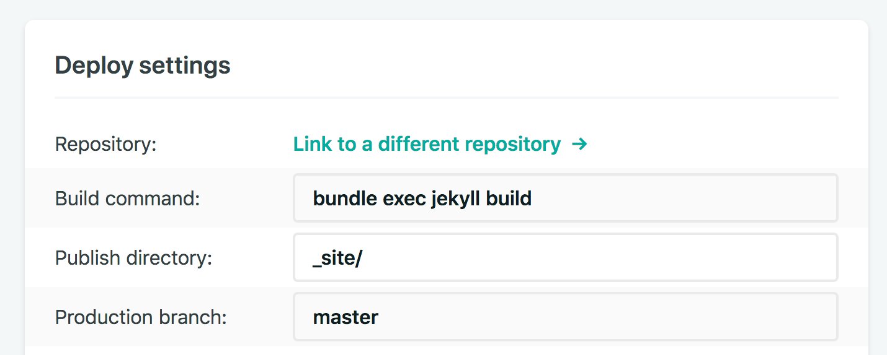

# computers :(

## Setup

You can use `bundle init` to generate a `Gemfile` and then
run `bundle install jekyll` to generate `Gemfile.lock` that freezes
the `jekyll` version.

Both files should be committed to version control.

## Local build

To test locally, if you have `ruby` and `bundle` installed,

	bundle install --path vendor/bundle
	bundle exec jekyll serve

## Netlify build

Netlify needs `.ruby-version` with a decent version, their default ruby is super old.

Set the build command to `bundle exec jekyll serve` and the publish directory to `_site/`.

